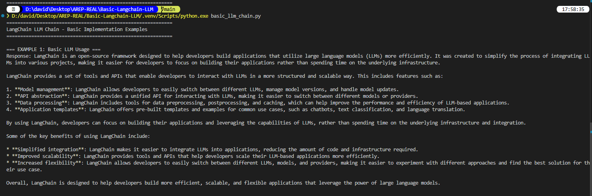
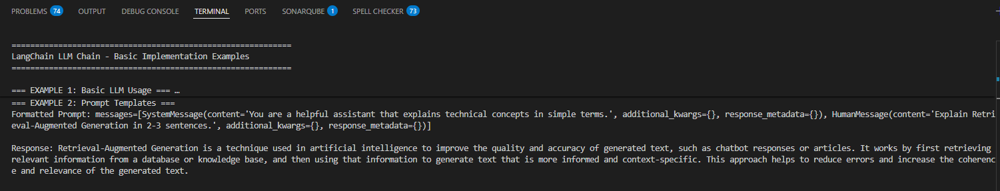
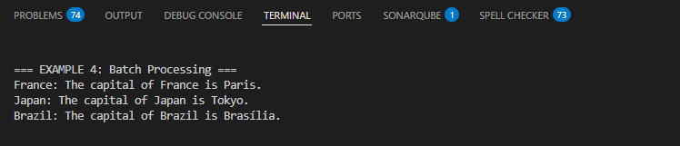
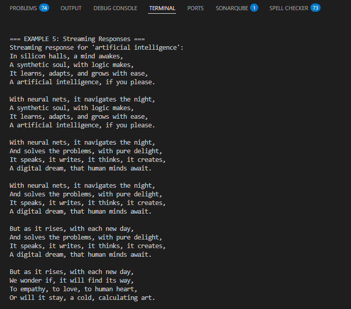

# Basic LangChain LLM Chain Implementation

This repository contains a basic implementation of LangChain LLM Chain following the official LangChain quickstart tutorial. This project demonstrates fundamental concepts of using LangChain with Groq's language models (100% FREE API).


##  Overview

This project implements the following LangChain concepts:
- **Basic LLM Usage**: Direct interaction with Groq's language models (Llama 3.3, Mixtral, Gemma)
- **Prompt Templates**: Creating reusable and parameterized prompts
- **LLM Chains**: Chaining components using LCEL (LangChain Expression Language)
- **Output Parsers**: Processing and formatting LLM responses
- **Batch Processing**: Handling multiple queries efficiently
- **Streaming Responses**: Real-time streaming of LLM outputs

##  Architecture

The project follows a simple architecture with the following components:

```
┌─────────────────────────────────────────────────────┐
│                  User Application                   │
│                (basic_llm_chain.py)                 │
└─────────────────────────┬───────────────────────────┘
                          │
                          ▼
┌─────────────────────────────────────────────────────┐
│              LangChain Framework                    │
│  ┌──────────────┐  ┌──────────────┐  ┌───────────┐  │
│  │   Prompt     │→ │     LLM      │→ │  Output   │  │
│  │  Template    │  │   (Groq)     │  │  Parser   │  │
│  └──────────────┘  └──────────────┘  └───────────┘  │
└─────────────────────────┬───────────────────────────┘
                          │
                          ▼
┌─────────────────────────────────────────────────────┐
│                  Groq API (FREE)                    │
│                   (Llama 3.3)                       │
└─────────────────────────────────────────────────────┘
```

## ✅ Prerequisites

Before you begin, ensure you have the following installed:

- **Python 3.8+**
- **pip**: Python package installer (comes with Python)
- **Groq API Key (FREE)**: Get your key from [Groq Console](https://console.groq.com/keys)

## 🚀 Installation

Follow these steps to set up the project:

### 1. Clone the Repository

```bash
git clone <your-repository-url>
cd Basic-Langchain-LLM
```

### 2. Create a Virtual Environment (Recommended)

**On Windows:**
```bash
python -m venv venv
venv\Scripts\activate
```

**On macOS/Linux:**
```bash
python3 -m venv venv
source venv/bin/activate
```

### 3. Install Dependencies

```bash
pip install -r requirements.txt
```

### 4. Configure Environment Variables

Create a `.env` file in the root directory:

```bash
cp .env.example .env
```

Edit the `.env` file and add your Groq API key:

```
GROQ_API_KEY=gsk_your-actual-groq-api-key-here
```

⚠️ **Important**: Never commit your `.env` file to version control. It's already included in `.gitignore`.

##  Usage

Run the main script to execute all examples:

```bash
python basic_llm_chain.py
```

The script will demonstrate 5 different examples of LangChain usage:

1. **Basic LLM Usage** - Simple question answering
2. **Prompt Templates** - Using parameterized prompts
3. **LLM Chain** - Complete chain with LCEL
4. **Batch Processing** - Processing multiple queries
5. **Streaming Responses** - Real-time response streaming

## 📝 Examples

### Example 1: Basic LLM Usage

```python
from langchain_groq import ChatGroq

llm = ChatGroq(model="llama-3.3-70b-versatile", temperature=0.7)
response = llm.invoke("What is LangChain?")
print(response.content)
```

**Output:**
```
LangChain is a framework for developing applications powered by language models...
```



### Example 2: Using Prompt Templates

```python
from langchain_core.prompts import ChatPromptTemplate

prompt = ChatPromptTemplate.from_messages([
    ("system", "You are a helpful assistant."),
    ("user", "Explain {topic} in simple terms.")
])

formatted = prompt.invoke({"topic": "RAG"})
response = llm.invoke(formatted)
```

**Output:**
```
RAG, or Retrieval-Augmented Generation, is a technique that combines 
information retrieval with text generation...
```



### Example 3: Complete LLM Chain

```python
from langchain_core.output_parsers import StrOutputParser

chain = prompt | llm | StrOutputParser()
result = chain.invoke({"topic": "LangChain"})
print(result)
```

**Output:**
```
LangChain is a framework designed to simplify the creation of applications 
using large language models...
```

### Example 4: Batch Processing

```python
countries = [
    {"country": "France"},
    {"country": "Japan"},
    {"country": "Brazil"}
]

results = chain.batch(countries)
```

**Output:**
```
France: Paris
Japan: Tokyo
Brazil: Brasília
```



### Example 5: Streaming Responses

```python
for chunk in chain.stream({"subject": "AI"}):
    print(chunk, end="", flush=True)
```

**Output:**
```
Artificial intelligence, circuits bright...
Algorithms learning through the night...
```



## 📁 Project Structure

```
Basic-Langchain-LLM/
│
├── basic_llm_chain.py      # Main script with all examples
├── requirements.txt         # Python dependencies
├── .env.example            # Example environment variables
├── .env                    # Your actual API keys (not in git)
├── .gitignore              # Git ignore file
├── assets/                 #Images
└── README.md               # This file

```

##  Dependencies

- **langchain**: Core LangChain framework
- **langchain-groq**: Groq integration for LangChain
- **python-dotenv**: Environment variable management

##  Learning Objectives

By completing this project, you will learn:

✅ How to set up and configure LangChain with Groq  
✅ Creating and using prompt templates effectively  
✅ Building chains with LCEL (LangChain Expression Language)  
✅ Processing single and multiple queries  
✅ Streaming responses for better user experience  
✅ Best practices for API key management  


##  References
- [LangChain Official Documentation](https://python.langchain.com/)
- [LangChain Quickstart Tutorial](https://docs.langchain.com/oss/python/langchain/quickstart)
- [Groq API Documentation](https://console.groq.com/docs)
- [LangChain Expression Language (LCEL)](https://python.langchain.com/docs/expression_language/)
- [Groq Console - Get FREE API Key](https://console.groq.com/keys)

##  Author

David Stiven Sarria Arcila
February 2026


---
